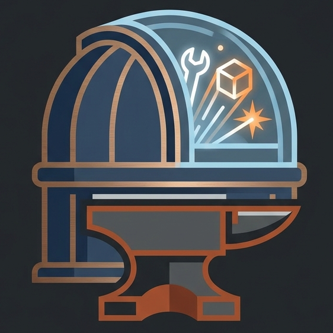

  

# Otelery

**A curated ecosystem of high-quality OpenTelemetry tools, helpers, and developer utilities.**

We bring together developers, platform engineers, and SRE practitioners who care about making OpenTelemetry practical. Every project in Otelery is held to a quality bar: well documented, actively maintained, and designed to work well with the rest of the ecosystem.

---

## What we build

- **Collectors and processors** that extend or simplify the OpenTelemetry Collector
- **SDKs and helpers** that wrap OTel instrumentation for specific languages or frameworks
- **Integrations** connecting OTel pipelines to backends, alerting systems, and dashboards
- **CLI tools and utilities** for working with traces, metrics, and logs day to day
- **Testing and validation** helpers that make instrumentation easier to verify

---

## Our values

**Open by default.** Everything we build is open source and free to use, fork, and improve.

**Spec first.** We follow the OpenTelemetry specification. Where we extend it, we make that clear.

**Practical over perfect.** We ship tools that solve real problems, even if the first version is rough around the edges.

**Community owned.** No single company controls Otelery. Maintainership is shared and newcomers are welcome.

---

## Get involved

We are early and there is a lot to do. Whether you want to fix a bug, write docs, share an idea, or build something new, there is room for you here.

- Browse our [repositories](https://github.com/orgs/otelery/repositories) to find something that interests you
- Open an issue or discussion to propose a new tool or share feedback
- Join the conversation in our community discussions

All contributors are expected to be respectful and collaborative. We will add a Code of Conduct soon.

---

## Relationship to OpenTelemetry

Otelery is an independent community project. We are not affiliated with or endorsed by the [OpenTelemetry project](https://opentelemetry.io) or the Cloud Native Computing Foundation. We build on top of OpenTelemetry and aim to complement the ecosystem, not replace any part of it.
